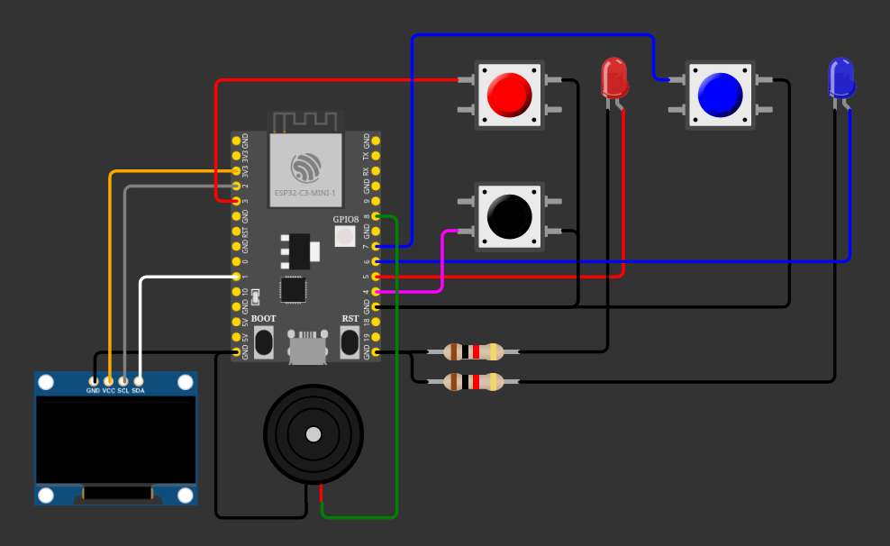

# reaction-time-game

## Sobre o projeto

Este projeto utilizou um ESP8266 (NodeMCU 0.9)
no desenvolvimento de jogo de tempo de reação.
Após o sinal sonoro e luminoso de ambos os LEDs,
ganha quem apertar o seu botão primeiro. Caso P1 
(botão vermelho) ganhe, será tocado a trilha sonora 
de Harry Potter e o LED vermelho se acenderá. Caso 
P2 (botão azul) ganhe, será tocada a trilha de 
Game of Thrones e o LED azul se ascenderá. As
informações do vencedor também aparecerão no
display, junto de seu tempo de reação em 
milisegundos. Após cada partida, é necessário
apertar o botão de reset. 
 
## Esquema do projeto

Observação: Imagem ilustrativa! A placa utilizada 
na figura não é do mesmo modelo que a utilizada 
no projeto real. Os pinos podem estar em posições
diferentes e possuir funções distintas. A numeração 
utilizada nas conexões foi pensada para ser 
exclusivamente compatível com o ESP8266.
